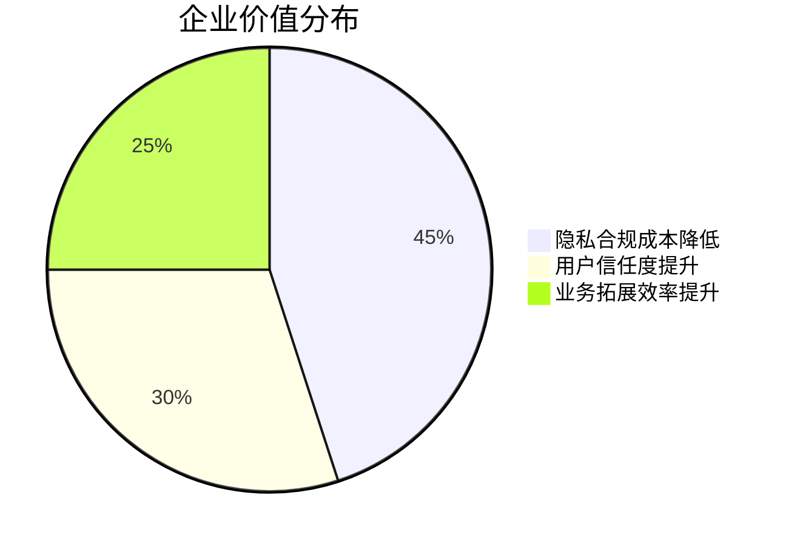

# ZkPass：区块链隐私验证技术革新

## 零知识证明技术的突破性应用

在数字身份验证领域，ZkPass凭借其创新的零知识证明技术，正在重新定义数据隐私保护标准。这项突破性技术不仅解决了传统验证方式中的信息暴露风险，更为Web3生态系统的安全交互提供了全新解决方案。通过3P-TLS协议与混合零知识证明技术的深度融合，用户现在可以在不泄露任何敏感信息的情况下完成可信验证。

👉 [探索零知识证明技术的未来应用](https://bit.ly/okx_welcome)

## 核心技术架构解析

### 三大核心技术支柱
| 技术模块        | 功能特性                     | 安全保障               |
|-----------------|------------------------------|------------------------|
| 零知识证明(ZKP) | 无需披露原始数据的验证机制   | 数学级隐私保护         |
| 三方TLS(3P-TLS) | 分布式密钥管理验证协议       | 防篡改数据溯源         |
| 多方计算(MPC)   | 分布式节点协同验证           | 抗量子计算安全架构     |

### 技术实现流程
1. **数据加密处理**：用户敏感信息通过VOLE-based IZK协议进行本地加密
2. **证明生成阶段**：在浏览器端毫秒级生成零知识证明
3. **分布式验证**：MPC节点网络协同验证数据真实性
4. **链上存证**：验证结果通过智能合约写入区块链

## 隐私保护的七大核心优势

1. **数据最小化原则**：仅验证必要信息维度
2. **端到端加密**：全程加密传输确保中间无暴露点
3. **抗量子计算**：采用抗量子攻击的加密算法
4. **动态权限控制**：支持细粒度访问权限管理
5. **可验证性保障**：所有验证过程可追溯审计
6. **跨平台兼容**：支持所有HTTPS网站无缝对接
7. **去中心化架构**：消除单点故障风险

👉 [立即体验隐私保护技术](https://bit.ly/okx_welcome)

## 典型应用场景全景图

### 金融领域创新应用
- **DeFi借贷验证**：在Aave等平台证明偿付能力而无需披露资产详情
- **跨境支付确认**：SWIFT交易中的KYC信息零知识验证
- **保险理赔核验**：医疗支出证明与保单匹配度验证

### 政府公共服务
- **电子身份认证**：数字护照信息的最小化披露
- **选举投票系统**：选民资格验证与投票匿名性保障
- **福利发放监管**：低保领取资格的隐私保护验证

### 医疗健康数据
- **病历共享授权**：特定诊断记录的定向验证
- **基因数据应用**：基因检测结果的可控披露
- **药物临床试验**：参与者健康数据的合规验证

## 技术创新的商业价值

### 对企业用户的三大价值提升

### 个人用户核心收益
- **隐私自主权**：完全掌控数据披露范围
- **安全增强**：杜绝数据二次滥用风险
- **验证效率**：毫秒级完成复杂验证流程

## 开发者生态建设

### 开发工具链全景
- **TransGate SDK**：支持主流DApp框架的集成工具包
- **验证器API**：标准化的零知识证明验证接口
- **沙箱测试环境**：支持全流程验证场景模拟
- **开发者激励计划**：百万美元生态基金扶持

### 集成实施路线图
1. **环境准备**：配置ES6+开发环境
2. **项目注册**：在zkPass开发者中心创建应用
3. **SDK集成**：安装npm包并初始化连接器
4. **验证配置**：定义数据验证Schema
5. **测试部署**：执行自动化测试套件验证

## 行业影响与未来发展

### 技术演进路线
- **2024 Q2**：推出移动端SDK 1.0
- **2024 Q4**：实现与Polkadot跨链协议集成
- **2025 Q1**：启动企业级定制化解决方案
- **2025 Q3**：完成ISO/IEC 27001认证

### 市场拓展战略
1. **标准制定**：参与IEEE隐私计算标准工作组
2. **行业联盟**：与GDPR合规机构建立合作
3. **垂直深耕**：重点突破金融科技与医疗健康领域
4. **全球化布局**：建立亚太、欧洲、北美三大运营中心

👉 [了解最新技术发展动态](https://bit.ly/okx_welcome)

## 常见问题解答（FAQ）

**Q：ZkPass如何确保验证过程的不可篡改性？**  
A：通过区块链存证与MPC节点网络的多重签名机制，所有验证记录均具备不可篡改特性，且可进行链上追溯验证。

**Q：是否需要特殊硬件设备支持？**  
A：完全基于浏览器实现，用户无需安装任何专用硬件设备，支持主流浏览器的扩展插件即插即用。

**Q：如何处理跨国验证的法律合规问题？**  
A：系统内置多法域合规引擎，自动适配GDPR、CCPA等不同地区的隐私法规要求，确保验证流程符合当地法律规范。

**Q：验证过程的计算资源消耗如何？**  
A：采用优化的VOLE-based IZK算法，验证过程CPU占用率低于5%，内存消耗控制在50MB以内，确保流畅用户体验。

**Q：如何应对量子计算威胁？**  
A：已部署抗量子计算的加密算法库，包含基于哈希的签名方案和格密码学方案，可实现平滑的量子安全升级。

**Q：是否支持离线验证场景？**  
A：提供离线验证凭证生成功能，支持在无网络连接环境下完成验证，后续同步时可进行链上存证验证。

## 经济模型与生态发展

### 代币经济关键指标
- **总量控制**：10亿枚zkP通证总量硬上限
- **流通机制**：动态燃烧机制调节市场供需平衡
- **激励体系**：涵盖验证节点、开发者、数据提供方的多维激励
- **治理模式**：DAO治理确保生态健康发展

### 生态发展里程碑
| 阶段   | 目标                              | 产出成果                  |
|--------|-----------------------------------|---------------------------|
| 孵化期 | 基础协议开发与核心团队组建        | 完成主网上线与SDK发布     |
| 成长期 | 生态应用培育与战略合作拓展        | 超100个DApp集成案例       |
| 成熟期 | 全球化部署与跨行业标准制定        | 建立5大区域运营中心       |

## 团队与合作伙伴

### 核心团队构成
- **技术研发团队**：包含8名密码学博士，15年以上区块链研发经验
- **合规专家团队**：覆盖GDPR、CCPA等多法域合规专家
- **商业拓展团队**：前高盛、麦肯锡等机构资深从业者
- **学术顾问团队**：来自MIT、清华等高校的密码学专家

### 战略合作网络
- **基础设施层**：与以太坊、Polkadot等主流公链深度合作
- **应用层**：已接入Aave、Uniswap等头部DeFi协议
- **监管科技**：与Chainalysis共建合规验证体系
- **学术研究**：与MIT Media Lab开展联合研究项目

## 未来展望

随着Web3.0生态的快速发展，ZkPass将持续推动隐私计算技术的创新应用。计划在2024年实现以下突破：
- **推出企业级解决方案**：开发定制化的隐私验证平台
- **扩展验证类型**：支持生物特征、物联网数据等新型数据源
- **建立验证者联盟**：打造去中心化的验证者经济生态
- **提升计算效率**：将证明生成时间缩短至50ms以内

这项革命性技术正在重塑数字世界的信任机制，为实现真正的数据主权奠定技术基础。随着技术的不断完善和生态的持续扩展，ZkPass有望成为连接现实世界数据与区块链价值的关键枢纽。
