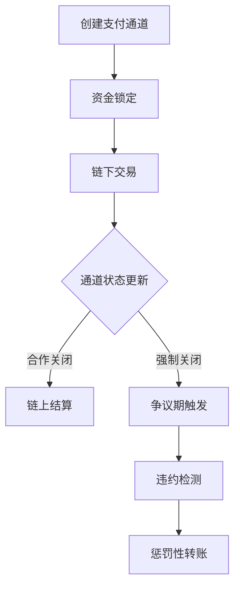

# 闪电网络：区块链支付的技术革新与应用实践

## 闪电网络的核心概念

闪电网络（Lightning Network）作为比特币的第二层支付协议，通过构建去中心化的支付通道网络，为区块链技术突破可扩展性瓶颈提供了创新解决方案。这项技术使节点间能够进行近乎即时的加密货币交易，其核心机制包含：

- **双向支付通道**：用户通过锁定比特币创建资金池，通道内可进行无限次链下交易
- **智能合约保障**：采用时间锁（Timelock）和哈希锁（Hashlock）技术确保交易安全
- **路由网络架构**：通过多跳支付实现跨通道资金流转，形成网状交易网络

> 这项技术突破使得比特币网络每秒处理交易量从7笔提升至百万级，交易确认时间从10分钟缩短至毫秒级

## 工作原理深度解析

### 支付通道生命周期
1. **通道建立**：双方将资金存入多重签名地址，生成初始交易记录
2. **链下交易**：通过更新余额分配方案实现即时价值转移
3. **通道结算**：最终将余额分配广播至区块链，完成资金清算

### 安全机制设计
- **惩罚机制**：采用违约补救交易（Penalty Transaction）防止节点作弊
- **瞭望塔服务**：第三方监控节点协助检测违规行为
- **时间锁约束**：通过CLTV（CheckLockTimeVerify）和CSV（CheckSequenceVerify）确保交易时效性

## 技术优势分析

### 核心竞争力对比
| 特性          | 链上交易       | 闪电网络       |
|---------------|----------------|----------------|
| 交易速度      | 10分钟/区块    | 毫秒级         |
| 交易费用      | 动态Gas费      | 微支付级费用   |
| 隐私保护      | 全账本公开     | 路径加密       |
| 扩展性        | 7TPS           | 理论百万TPS    |
| 微支付支持    | 不支持         | 支持毫聪级交易 |

### 创新应用场景
1. **物联网支付**：实现设备间自动化的微额结算
2. **跨境汇款**：7×24小时即时到账，降低中间成本
3. **数字内容变现**：支持按阅读量/观看时长的实时付费模式
4. **去中心化交易所**：通过原子交换实现跨链资产流转

👉 [了解如何通过闪电网络实现即时支付](https://bit.ly/okx_welcome)

## 实际应用案例

### 全球化实践进展
- **萨尔瓦多**：国家钱包Chivo集成闪电网络，实现法定货币与比特币的即时转换
- **委内瑞拉**：通过"闪电火炬"传递439万聪，支持比特币普及项目
- **交易所应用**：Bitfinex、Kraken等平台使用闪电网络优化充提体验

### 典型交易流程
1. 用户A与B建立支付通道，各自存入5BTC
2. A向B支付1BTC，更新通道余额（A:4BTC/B:6BTC）
3. B路由支付给C，利用共同节点完成跨通道转账
4. 通道持续运行期间，可进行数千次链下交易

## 技术演进历程

### 关键里程碑
- **2015年**：Joseph Poon和Thaddeus Dryja发布白皮书初稿
- **2017年**：
  - Blockstream完成首个莱特币闪电支付
  - BOLT协议规范正式确立
- **2019年**："闪电火炬"传递引发行业关注
- **2021年**：萨尔瓦多立法采用比特币为法定货币

### 开发生态现状
- **主要实现**：
  - LND（Go语言，Lightning Labs）
  - c-lightning（C语言，Blockstream）
  - Eclair（Scala，ACINQ）
- **创新方向**：
  - 支付点（Payment Points）提升路由效率
  - PTLC（点时间锁合约）增强隐私保护
  - 多路径支付优化资金利用率

👉 [探索闪电网络技术实现细节](https://bit.ly/okx_welcome)

## 常见问题解答

### 闪电网络是否需要完全信任交易对手？
不需要。智能合约机制确保任何一方无法单方面挪用资金，违约行为将触发惩罚机制。

### 如何选择最佳支付路径？
系统采用改进的Dijkstra算法，综合评估通道容量、费用和跳数等因素进行动态路由。

### 通道资金是否会被永久锁定？
资金仅在通道开启期间锁定，结算后可自由转移。争议期通常设置为24-48小时。

### 是否需要持续在线维护通道？
节点不在线会导致通道暂时不可用，但不会影响资金安全。可委托瞭望塔服务进行监控。

### 交易手续费如何计算？
费用由路径中各中间节点设定，通常为支付金额的0.0001%-0.1%，具体取决于网络状况。

## 未来发展展望

### 技术优化方向
- **流动性管理**：开发自动化通道平衡工具
- **跨链扩展**：完善原子交换协议支持多资产流转
- **隐私增强**：引入零知识证明技术

### 商业化应用前景
- **零售支付**：便利店、自动贩卖机集成闪电支付
- **金融衍生品**：开发基于闪电网络的期权、期货产品
- **社交支付**：社交媒体平台集成即时打赏功能

### 生态建设挑战
- **节点激励**：建立可持续的路由费用经济模型
- **用户体验**：降低钱包使用门槛
- **监管合规**：探索符合反洗钱（AML）要求的解决方案

👉 [查看闪电网络最新技术动态](https://bit.ly/okx_welcome)

## 结语

闪电网络作为区块链扩展性问题的突破性解决方案，正在重塑数字支付的未来。通过持续的技术创新和生态完善，这项技术有望推动加密货币从价值存储向日常支付工具转型，实现真正的金融普惠。随着萨尔瓦多等国家的实践验证，以及更多商业场景的落地应用，闪电网络正在构建一个更高效、低成本、全球化价值转移网络。